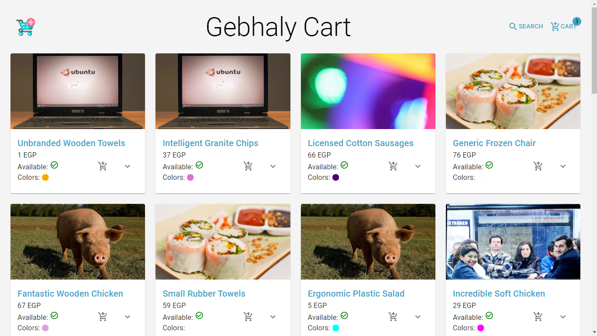
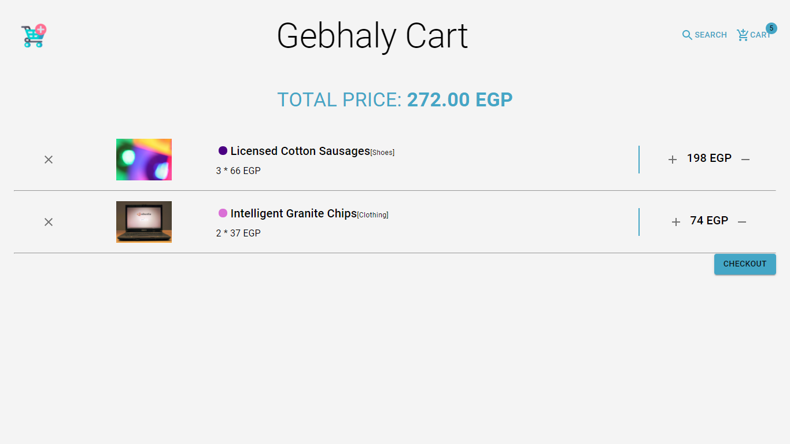
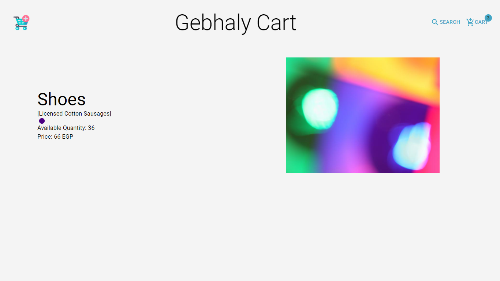
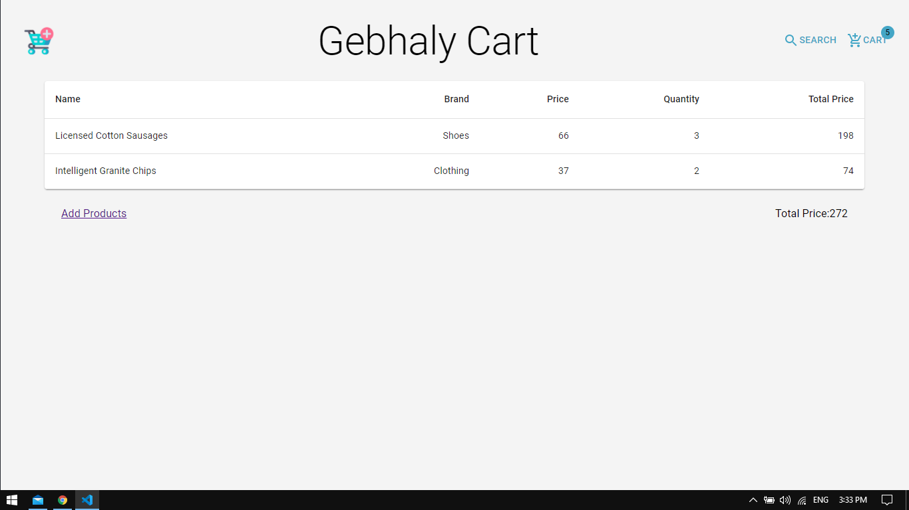
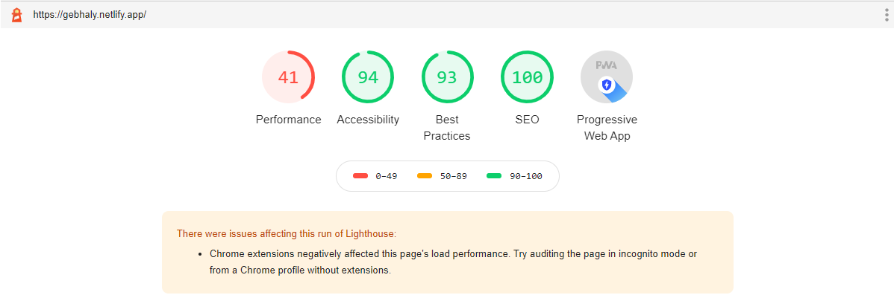

# Gebhaly

This project is a small task from gebhaly, Shopping Cart

## Technology

- React
- Redux / Thunks
- Material-UI
- Sass

## Note

This is also a PWA, which means you can install this website as a mobile or desktop app.

## Live-Website

<a href="https://gebhaly.netlify.app/">https://gebhaly.netlify.app</a>

## Preview

    
    

    
    

## Logs

Estimated Time: 6 
Total Hours: 6.5

- 2 hr Sunday (Create Project, Repo, Deployment, Made PWA, Setup Project with Redux and React-Router-Dom, Structure Project) 
- 1 hr Sunday (Create Product Page and it's reducer and action)
- 2.5 hr Monday (Create cart Page and it's reducer and action)
- 1 hr Monday (Clean Porject, Run light House Test, Edit Readme.md)

